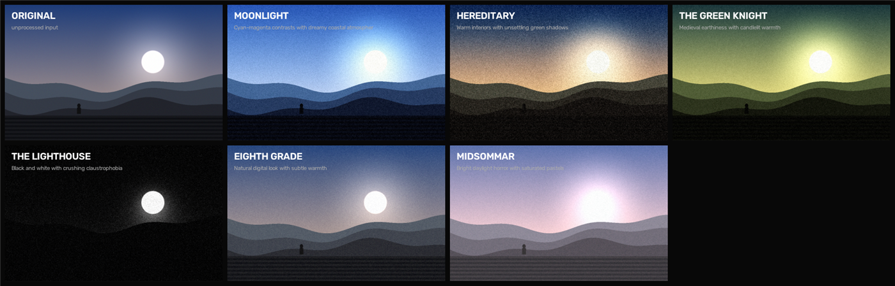
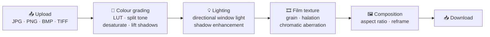

<div align="center">

# A24Colour

### Give any photo the look of an A24 film.

**Six film-grade presets — Moonlight, Hereditary, The Green Knight, The Lighthouse, Eighth Grade, Midsommar — built from split toning, film grain, halation, chromatic aberration and simulated lighting. FastAPI backend, React frontend, one `docker-compose up`.**


[](LICENSE)
[](#contributing)



<sub>One source image through all six presets. Generated by running this repo's own processor — reproduce it with the script in <a href="#reproducing-the-grid">Reproducing the grid</a>.</sub>

</div>

---

## What it does

Upload a photo, pick a film, get it back graded. Each preset is a bundle of parameters driving a five-stage pipeline — not a filter slapped on top.



## The presets

| Style | Look | Grain | Temperature | Aspect |
|---|---|---|---|---|
| **Moonlight** | Cyan-magenta contrasts, dreamy coastal atmosphere | 35mm | Cool | Cinematic |
| **Hereditary** | Warm interiors with unsettling green shadows | 16mm | Warm | Standard |
| **The Green Knight** | Medieval earthiness, candlelit warmth | 35mm | Warm | Cinematic |
| **The Lighthouse** | Black and white, crushing claustrophobia | 16mm | Cool | Academy |
| **Eighth Grade** | Natural digital look, subtle warmth | Digital | Neutral | Standard |
| **Midsommar** | Bright daylight horror, saturated pastels | 35mm | Warm | Standard |

Every parameter is overridable per request — desaturation, shadow lift, grain intensity, halation strength, chromatic aberration, lighting direction and intensity. Presets live in [`backend/app/processors/style_presets.py`](backend/app/processors/style_presets.py).

## Quick start

### Docker

```bash
git clone https://github.com/moeezalam/A24Colour.git
cd A24Colour
docker-compose up --build
```

Frontend on `http://localhost:3000`, API on `http://localhost:8000`, interactive API docs on `http://localhost:8000/docs`.

### Manual

```bash
cd backend
python -m venv venv && venv\Scripts\activate      # macOS/Linux: source venv/bin/activate
pip install -r requirements.txt
uvicorn app.main:app --reload --port 8000
```

```bash
cd frontend
npm install
npm start
```

## API

Base path `/api/v1`.

| Method | Route | Purpose |
|---|---|---|
| `GET` | `/styles/` | List styles with their full preset parameters |
| `GET` | `/styles/{style_name}/` | One preset's details |
| `POST` | `/process-image/` | Multipart upload → graded image bytes back |
| `POST` | `/process-image-async/` | Queue a job, poll for the result |
| `GET` | `/job-status/{job_id}` | Async job state |
| `GET` | `/health/` | Health check |

```bash
curl -X POST http://localhost:8000/api/v1/process-image/ \
  -F "image=@photo.jpg" \
  -F "style=hereditary" \
  -F 'custom_settings={"grain_intensity":0.6,"desaturation":0.4}' \
  --output graded.jpg
```

Limits, from [`backend/app/config.py`](backend/app/config.py): 10 MB max upload, images over 2048 px are downscaled first, JPEG output at quality 95.

## Reproducing the grid

The figure at the top is real output, not a mockup. It was produced by importing `EnhancedA24StyleProcessor` directly and running one synthetic scene through all six presets:

```python
import cv2, sys
sys.path.insert(0, "backend")
from app.processors.enhanced_a24_processor import EnhancedA24StyleProcessor

proc = EnhancedA24StyleProcessor("backend/assets")
src = cv2.imread("photo.jpg")                     # BGR in
out = proc.process_image_array(src, "hereditary") # RGB out
cv2.imwrite("out.jpg", cv2.cvtColor(out, cv2.COLOR_RGB2BGR))
```

Note the colour-space convention: the processor takes BGR (what `cv2.imread` gives you) and returns RGB. The API handles the flip back in `prepare_image_response`; if you call the processor directly, you must.

## Known issues

Measured on the sample scene above, so you know what you're getting:

- **The Lighthouse preset crushes the image.** Mean brightness drops from 84 to 12 out of 255 — an 86% loss. Saturation falls to 7, so the black-and-white intent lands, but almost all detail is gone. The exposure compensation for that preset needs work.
- **Aspect-ratio control doesn't run on the API path.** The `aspect_ratio` field is defined on every preset and `AspectRatioProcessor` is implemented, but `EnhancedA24StyleProcessor` — the one the endpoints actually use — never calls it. Only the older `A24StyleProcessor` applies composition.
- **The LUTs are procedural.** They approximate each film's palette; they are not the actual LUTs used in production.
- **Two empty modules:** `backend/app/core/composition.py` and `backend/app/services/enhanced_style_service.py` are 0 bytes. `frontend/src/hooks/useImageProcessing.tsx` and `frontend/src/services/api.tsx` are 0-byte duplicates of the real `.ts` files and should be deleted.
- **Redis and Celery are declared but barely wired.** Async jobs currently live in an in-process dict, so they don't survive a restart or scale past one worker.
- **CPU only.** 2–5 seconds per image is typical.

## Contributing

Good entry points, roughly in order of impact:

1. **Fix the Lighthouse exposure** — the most visible defect in the whole project
2. **Call the composition stage** from the enhanced processor so aspect ratios apply
3. **Real LUT support** — load `.cube` files instead of generating curves procedurally
4. **A before/after slider** in the frontend instead of two static panels
5. **Batch mode** — a folder in, a graded folder out, no UI
6. **More presets** — Ex Machina, Under the Skin, Everything Everywhere All at Once
7. **Finish the Celery path** so async jobs survive a restart

## License

MIT — see [LICENSE](LICENSE).

Not affiliated with, endorsed by, or connected to A24 Films LLC. "A24" and the film titles referenced are trademarks of their respective owners; they're used here only to describe the visual style each preset approximates.

---

<div align="center">

**If your holiday photos now look like a horror film, star the repo.**

</div>
